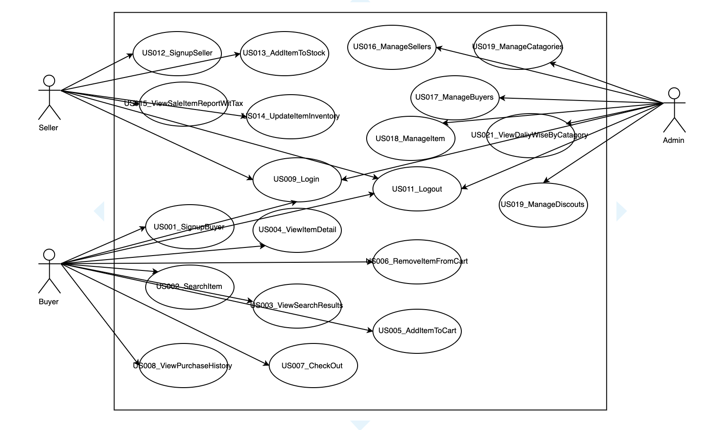

# eMart Architect Design

## System Context

## Use Case Model

### Use Case Model Overview

| Use Case ID | Use Case Name | Description
|:---:|:---|:---|
|US001|Buyer Sign Up|as A vistor, I use **Buyer Info** to register new account to become a new buyer
|US002|Search Item|As a Buyer, I enter the keys words to search box for searching items,  Then he lick search button and get the return items cospoding the key words.
|US003|View Searching Result|As a Buyer, I can view the item list with Price, Manufacturer etc and also can filter item by Price,Manufacturer etc.
|US004|View Item Detail|As a Buyer, I eneter an row of item to view  **the detail of the Item**.
|US005|Add Item To Cart|As a Buyer, I add the current item to Cart on the detail page of the current item, then I also can open my cart to view check out with **amount and tax ammout**
|US006|Rmmove Item From Cart|As a Buyer, I remove the item in my items page.
|US007|Check Out|As a Buyer, I can enter my discout code and then checkout my order.
|US008|View Purchase History|As a Buyer, I can view my purchase history with item, numbers.
|US009|Login|As a eMart User, I can login the eMart with my useranme and password
|US011|Logout|As a eMart User, I can logout eMart by click logout button.
|US012|Seller Sign Up|A vistor, I user my **Seller Info** to register new account to become a new Seller.
|US013|Add Item To Stock|As a Seller, I can add new **Item** with invertory numbers on my Stock Page.
|US014|Update Inventory|As a Seller, I can view my items' inventory with sold and remaining and also can add number base on remaining number.
|US015|View Sale Item Report With Tax|As a Seller, I can view my the item sale report with filter by start date and end date.
|US016|Manage Sellers|As a Admin, I can block or unblock a seller on sellers managment page.
|US017|Manage Buyers|As a Admin, I can block or unblock a seller on the buyers managment page.
|US018|Manage Item|As a Admin, I can block or unblock sold item on the items management page.
|US019|Manage Catagories|As a Admin, I can add or remove catagory including sub catagory.
|US020|Manage Discount|As a Admin, I can add or update discounts on the discount page.
|US021|View Daliy Wise By Catagory|As a Admin, I can view the daily wise report on my dashboard.

## Data Model

## Architecture Overview

|Component|Description|Use Case Map|
|:---|:---|:---:|
|eMart Web|Provide web UI based angular application to  Buyer, Seller and Admin|US1 to US21|
|API Gateway|Unique API endpoint for eMart Web, it will expose all backend api, and check the JWT token with Idenity Service|US1 to US21
|Service Discovery|Provide service registry and discovery for all backend service|none|
|Identity Service|It provides authorization and authenication, and manage users credienal and user profile for buyer, seller and admin|US001,US009,US011,US12,US16,US17|
|Inventory Service|It manage all items in stock provided by sellers, and provide all apis for items on eMarkt web.|US002,US004,US005,US006, US013, US014,US018,US019|
|Shopping Cart|Provide a cart to buy something for buyers|US005,US006
|Order Service|Manage the order from buyser, and control the status of transcations|US007|
|Financial Service|Provide transaction api and purchase history|US007,US008,US009,US015,US021
|Mock Payment Gateway|Mock service as Payment Gateway|US007

## Frontend Component Model

## Backend Component Model

